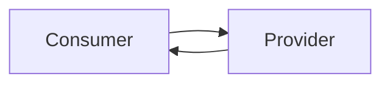
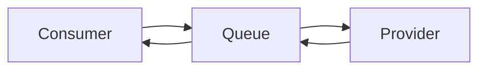

> RPC系统结构



Consumer调用的Provider提供的服务。

>  Message Queue系统结构：



Sender发送消息给Queue；Receiver从Queue拿到消息来处理。

在架构上，RPC和Message的差异点是，Message有一个中间结点Message Queue，可以把消息存储。

**消息的特点**

Message Queue把请求的压力保存一下，逐渐释放出来，让处理者按照自己的节奏来处理。
Message Queue引入一下新的结点，让系统的可靠性会受Message Queue结点的影响。
Message Queue是异步单向的消息。发送消息设计成是不需要等待消息处理的完成。
所以对于有同步返回需求，用Message Queue则变得麻烦了。

**RPC的特点**

同步调用，对于要等待返回结果/处理结果的场景，RPC是可以非常自然直觉的使用方式。

RPC也可以是异步调用。

由于等待结果，Consumer（Client）会有线程消耗。

如果以异步RPC的方式使用，Consumer（Client）线程消耗可以去掉。但不能做到像消息一样暂存消息/请求，压力会直接传导到服务Provider。


- Service     A的应用层代码中，调用了Calculator的一个实现类的add方法，希望执行一个加法运算；
- 这个Calculator实现类，内部并不是直接实现计算器的加减乘除逻辑，而是通过远程调用Service     B的RPC接口，来获取运算结果，因此称之为**Stub**；
- Stub怎么和Service     B建立远程通讯呢？这时候就要用到**远程通讯工具**了，也就是图中的**Run-time Library**，这个工具将帮你实现远程通讯的功能，比如Java的**Socket**，就是这样一个库，当然，你也可以用基于Http协议的**HttpClient**，或者其他通讯工具类，都可以，**RPC并没有规定说你要用何种协议进行通讯**；
- Stub通过调用通讯工具提供的方法，和Service     B建立起了通讯，然后将请求数据发给Service B。需要注意的是，由于底层的网络通讯是基于**二进制格式**的，因此这里Stub传给通讯工具类的数据也必须是二进制，比如calculator.add(1,2)，你必须把参数值1和2放到一个Request对象里头（这个Request对象当然不只这些信息，还包括要调用哪个服务的哪个RPC接口等其他信息），然后**序列化**为二进制，再传给通讯工具类，这一点也将在下面的代码实现中体现；
- 二进制的数据传到Service     B这一边了，Service B当然也有自己的通讯工具，通过这个通讯工具接收二进制的请求；
- 既然数据是二进制的，那么自然要进行**反序列化**了，将二进制的数据反序列化为请求对象，然后将这个请求对象交给Service     B的Stub处理；
- 和之前的Service     A的Stub一样，这里的Stub也同样是个“假玩意”，它所负责的，只是去解析请求对象，知道调用方要调的是哪个RPC接口，传进来的参数又是什么，然后再把这些参数传给对应的RPC接口，也就是Calculator的实际实现类去执行。很明显，如果是Java，那这里肯定用到了**反射**。
- RPC接口执行完毕，返回执行结果，现在轮到Service     B要把数据发给Service A了，怎么发？一样的道理，一样的流程，只是现在Service B变成了Client，Service     A变成了Server而已：Service B反序列化执行结果->传输给Service A->Service A反序列化执行结果     -> 将结果返回给Application，完毕。

## RabbitMQ

提到RabbitMQ，就不得不提AMQP协议。AMQP协议是具有现代特征的二进制协议。是一个提供统一消息服务的应用层标准高级消息队列协议，是应用层协议的一个开放标准，为面向消息的中间件设计。

AMQP协议中间的几个重要概念：

- Server：接收客户端的连接，实现AMQP实体服务。

- Connection：连接，应用程序与Server的网络连接，TCP连接。

- Channel：信道，消息读写等操作在信道中进行。客户端可以建立多个信道，每个信道代表一个会话任务。

- Message：消息，应用程序和服务器之间传送的数据，消息可以非常简单，也可以很复杂。有Properties和Body组成。Properties为外包装，可以对消息进行修饰，比如消息的优先级、延迟等高级特性；Body就是消息体内容。

- Virtual     Host：虚拟主机，用于逻辑隔离。一个虚拟主机里面可以有若干个Exchange和Queue，同一个虚拟主机里面不能有相同名称的Exchange或Queue。

- Exchange：交换器，接收消息，按照路由规则将消息路由到一个或者多个队列。如果路由不到，或者返回给生产者，或者直接丢弃。RabbitMQ常用的交换器常用类型有direct、topic、fanout、headers四种，后面详细介绍。

- Binding：绑定，交换器和消息队列之间的虚拟连接，绑定中可以包含一个或者多个RoutingKey。

- RoutingKey：路由键，生产者将消息发送给交换器的时候，会发送一个RoutingKey，用来指定路由规则，这样交换器就知道把消息发送到哪个队列。路由键通常为一个“.”分割的字符串，例如“com.rabbitmq”。

- Queue：消息队列，用来保存消息，供消费者消费。

    ```mermaid
    flowchart LR
    
    subgraph Server
        subgraph Virtual Host
            A(Exchange) --- B(Message Queue)
        end
    end
    Publisher\nApplication --> A
    B --> Consumer\nApplication
    ```

    

**常用交换器**

RabbitMQ常用的交换器类型有direct、topic、fanout、headers四种。

| 交换器类型       | 说明                                                         |
| :--------------- | :----------------------------------------------------------- |
| Direct Exchange  | 该类型的交换器将所有发送到该交换器的消息被转发到RoutingKey指定的队列中，也就是说路由到BindingKey和RoutingKey完全匹配的队列中。 |
| Topic Exchange   | 该类型的交换器将所有发送到Topic Exchange的消息被转发到所有RoutingKey中指定的Topic的队列上面。 |
| Fanout Exchange  | 该类型不处理路由键，会把所有发送到交换器的消息路由到所有绑定的队列中。优点是转发消息最快，性能最好。 |
| Headers Exchange | 该类型的交换器不依赖路由规则来路由消息，而是根据消息内容中的headers属性进行匹配。headers类型交换器性能差，在实际中并不常用。 |

实现原理：


1. 客户端 Client 设置消息的 routing key 为 Service 的队列 op_q；设置消息的 reply-to 属性为返回的 response 的目标队列 reponse_q，设置其 correlation_id 为以随机UUID，然后将消息发到 exchange。比如 channel.basic_publish(exchange='', routing_key='op_q', properties=pika.BasicProperties(reply_to = reponse_q, correlation_id = self.corr_id),body=request)

2.  Exchange 将消息转发到 Service 的 op_q

3. Service 收到该消息后进行处理，然后将response 发到 exchange，并设置消息的 routing_key 为原消息的 reply_to 属性，以及设置其 correlation_id 为原消息的 correlation_id 。

    ```python
    ch.basic_publish(exchange='',
                     routing_key=props.reply_to, 
                     properties=pika.BasicProperties(
                         correlation_id = props.correlation_id),
                     body=str(response))
    ```

4. Exchange 将消息转发到 reponse_q

5. Client 逐一接受 response_q 中的消息，检查消息的 correlation_id 是否为等于它发出的消息的correlation_id，是的话表明该消息为它需要的response。