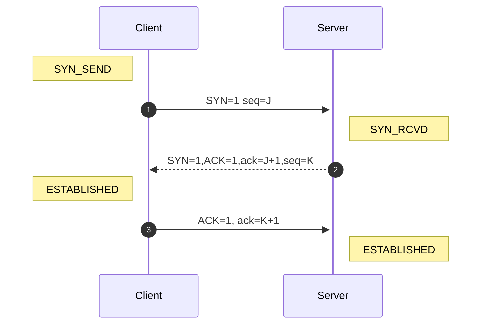
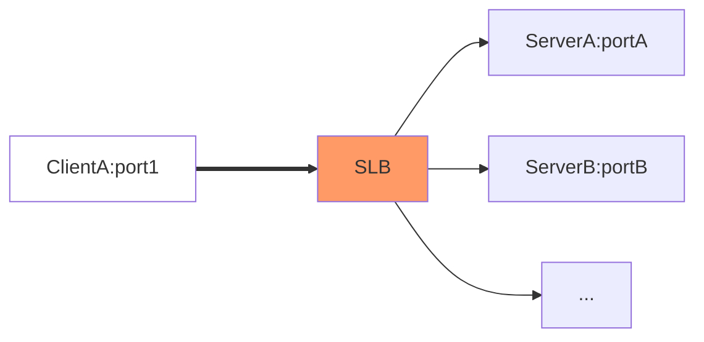
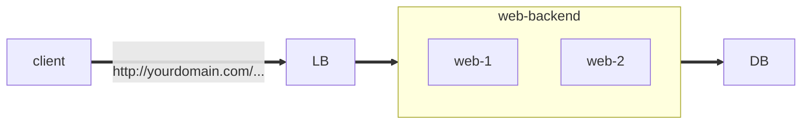
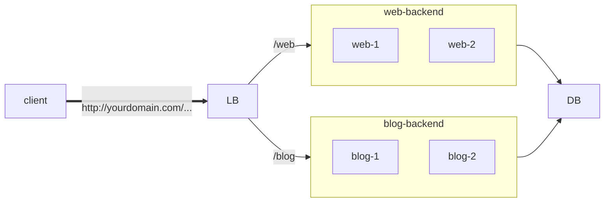

## 三次握手

## 网络设备

### 网关和路由器

网关与路由器两者它们的作用都是用在网络当中，主要是用来连接不同子网的主机，这两种都是属于硬件设施，它们都可以对到达该主机的数据包进行转发。

网关（Gateway）就是一个网络连接到另一个网络的“关口

网关实质上是一个网络通向其他网络的IP地址。比如有网络A和网络B，网络A的IP地址范围为“192.168.1.1~192. 168.1.254”，子网掩码为255.255.255.0；网络B的IP地址范围为“192.168.2.1~192.168.2.254”，子网掩码为255.255.255.0。

​    在没有路由器的情况下，两个网络之间是不能进行TCP/IP通信的，即使是两个网络连接在同一台交换机（或集线器）上，TCP/IP协议也会根据子网掩码（255.255.255.0）判定两个网络中的主机处在不同的网络里。而要实现这两个网络之间的通信，则必须通过网关。

​    如果网络A中的主机发现数据包的目的主机不在本地网络中，就把数据包转发给它自己的网关，再由网关转发给网络B的网关，网络B的网关再转发给网络B的某个主机。网络B向网络A转发数据包的过程也是如此。    

   所以说，只有设置好网关的IP地址，TCP/IP协议才能实现不同网络之间的相互通信。那么这个IP地址是哪台机器的IP地址呢？网关的IP地址是具有路由功能的设备的IP地址，具有路由功能的设备有路由器、启用了路由协议的服务器（实质上相当于一台路由器）、代理服务器（也相当于一台路由器）

 路由器（Router）是一种负责寻径的网络设备，它在互连网络中从多条路径中寻找通讯量最少的一条网络路径提供给用户通信。路由器用于连接多个逻辑上分开的网络。对用户提供最佳的通信路径，路由器利用路由表为数据传输选择路径，路由表包含网络地址以及各地址之间距离的清单，路由器利用路由表查找数据包从当前位置到目的地址的正确路径。路由器使用最少时间算法或最优路径算法来调整信息传递的路径，如果某一网络路径发生故障或堵塞，路由器可选择另一条路径，以保证信息的正常传输。路由器可进行数据格式的转换，成为不同协议之间网络互连的必要设备。   

### 负载均衡

负载均衡有两方面的含义：

- 首先，大量的并发访问或数据流量分担到多台节点设备上分别处理，减少用户等待响应的时间；
- 其次，单个重负载的运算分担到多台节点设备上做并行处理，每个节点设备处理结束后，将结果汇总，返回给用户，系统处理能力得到大幅度提高。

  目前负载均衡技术大多数是用于提高诸如在Web服务器、FTP服务器和其它关键任务服务器上的Internet服务器程序的可用性和可伸缩性。

分类

| 类别                 | 说明                                                         |
| -------------------- | ------------------------------------------------------------ |
| 二层负载均衡（mac）  | 根据OSI模型分的二层负载，一般是用虚拟mac地址方式，外部对虚拟MAC地址请求，负载均衡接收后分配后端实际的MAC地址响应.** |
| 三层负载均衡（ip）   | 一般采用虚拟IP地址方式，外部对虚拟的ip地址请求，负载均衡接收后分配后端实际的IP地址响应. (即一个ip对一个ip的转发, 端口全放开) |
| 四层负载均衡（tcp）  | 在三次负载均衡的基础上，即从第四层"传输层"开始, 使用"虚拟ip+port"接收请求，再转发到对应的机器。 |
| 七层负载均衡（http） | 从第七层"应用层"开始, 根据虚拟的url或IP，主机名接收请求，再转向相应的处理服务器。 |

> 四层、七层负载均衡的区别

 所谓的四到七层负载均衡，就是在对后台的服务器进行负载均衡时，依据四层的信息或七层的信息来决定怎么样转发流量。

1. 四层就是基于IP+端口的负载均衡；
2. 七层就是基于URL等应用层信息的负载均衡；
3. 同理，还有二层负载均衡（基于MAC地址），三层负载均衡（基于IP地址）；

**在反向代理模式下，**

当负载均衡设备收到客户端请求后，会记录下此报文（ 源IP地址、目的IP地址、协议号、源端口、目的端口，服务类型以及接口索引），

将报文（**目的地址更改为优选后的RS设备的IP地址**，目的端口号不变；

​       源地址修改为负载均衡设备下行与对应RS设备接口的IP地址，源端口号随机）发送给RS；

当RS收到报文后，会以（RS接口IP地址为源，负载均衡设备地址为目的）回复报文；

负载均衡设备将源修改为VIP，目的端口号修改为客户端的源端口号，目的IP修改为Client的源IP回复报文。

> 七层SLB和四层SLB的区别：

四层SLB：配置负载均衡设备上服务类型为tcp/udp，负载均衡设备将只解析到4层，负载均衡设备与client三次握手之后就会和RS建立连接；

七层SLB：配置负载均衡设备服务类型为http/ftp/https等，负载均衡设备将解析报文到7层，

在负载均衡设备与client三次握手之后，只有收到对应七层报文，才会跟RS建立连接。

在负载均衡设备中，SLB主要工作在以下的三种传输模式中：

反向代理：  相同的 IP+Port 对应同一批 backend

负载均衡 ： 相同的 IP + Port 可以对应不同的 backend

例如: haproxy 通过定义 ACL , 设置不同的的转发策略

 

 对服务器做动静分离

HAProxy作为L4负载均衡器工作时，不会去解析任何与HTTP协议相关的内容，只在传输层对数据包进行处理。也就是说，以L4模式运行的HAProxy，无法实现根据URL向不同后端转发、通过cookie实现会话保持等功能。同时，在L4模式下工作的HAProxy也无法提供监控页面。但作为L4负载均衡器的HAProxy能够提供更高的性能，适合于基于套接字的服务（如数据库、消息队列、RPC、邮件服务、Redis等），或不需要逻辑规则判断，并已实现了会话共享的HTTP服务。

mode:

| mode | detail                              |
| ---- | ----------------------------------- |
| tcp  | 纯TCP模式，4层负载均衡              |
| http | http模式，实现7层过滤，处理内容交换 |

balance 算法

- roundrobin: 轮询
- static-rr:     轮询，在线修改权重时不生效
- leastconn: 最小连接数
- first:     先让一台达到maxconn，然后再使用另外一台没达到的
- source: 基于客户端来源的哈希
- uri:     根据uri的部分或者完成uri进行哈希

**会话保持机制**

保证同一个客户端的连续的请求被调度到同一个后端服务器，有两种基本方法

- balance source # 基于源地址的调度
- appsession insert indirect preserve, appsession是指HAProxy插入到响应内容中的cookie名称,insert是指如果客户端请求中没有该字段则插入appsession, indirect是指向后端服务器发送客户端请求时删除appsession, preserve与insert或indirect合用时，使得后端发送该名字（appsession）的 cookie时不被HAProxy删除或者替换掉

TCP 模式下 HAProxy 无法通过HTTP Cookie实现会话保持，但可以实现基于客户端IP的会话保持，`balance source`

**Layer 4 LoadBalance**

**Layer 7 LoadBalance**

总的来说，一般是lvs做4层负载；nginx做7层负载(也能做4层负载, 通过stream模块)；

haproxy比较灵活，4层和7层负载均衡都能做
