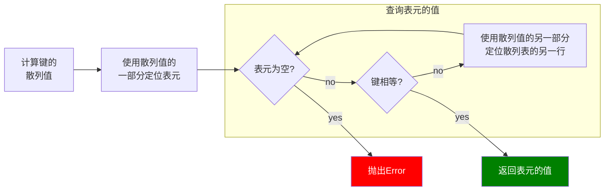

## 3.dict 和set

### 处理找不到的键

1. setdefault 
2. collections.defaultdict 
   
   defaultdict(default_factory)把参数作为default_factory,用来构造一个defaultdict, 只会在 __getitem__ 里被调用，在其他方法里不会发挥作用

> 关于 setdefault 的例子

```python
my_dict = {}
my_dict.setdefault('key1', 1) 
print(my_dict['key1'])     
print(my_dict.get('key1'))
"""output:
1   1
"""  
```

> 关于 defaultdict 的例子

```python
import collections
my_dict = collections.defaultdict(list)     print(my_dict.get('key1'))    
print(my_dict['key1'])
"""output:
None  []
"""   
```

 所有映射类型在早不到key 时，都会涉及到特殊方法 __missing__, __missing__ 只对 __getitem__ 有效,对get,__contains__ 等没有影响

## dict的变种

1. collections.OrderedDict  添加键的时候保持顺序
2. collections.ChainMap   把多个 mappings  合并, 如果有重复的key, 查询时返回的是第一个
3. collections.Counter  给dict 准备一个 计算器，每次更新一次key, 计数器 加1，例如统计字符串每个字符的个数
4. collections.UserDict    用于自定义映射类型

示例：

```python
In [19]: import collections
In [20]: my_dict = collections.OrderedDict()
In [22]: my_dict['b'] = 1
In [23]: my_dict['a'] = 2
In [24]: my_dict
Out[24]: OrderedDict([('b', 1), ('a', 2)])

In [25]: for k, v in my_dict.items():
    ...:     print(k, v)
    ...: 
b 1
a 2
```

```python
In [1]: import collections
In [2]: my_dict = collections.ChainMap({'a': 1}, {'a': 11, 'b': 2}, {'c': 3})
In [3]: my_dict
Out[3]: ChainMap({'a': 1}, {'a': 11, 'b': 2}, {'c': 3})

In [4]: my_dict['a']
Out[4]: 1

In [5]: my_dict['b']
Out[5]: 2

In [6]: 
```

```python
In [6]: my_dict = collections.Counter('aaabbc')
In [8]: my_dict
Out[8]: Counter({'a': 3, 'b': 2, 'c': 1})
In [8]: 
In [9]: my_dict.update(['aaa', 'd', 'c'])
In [11]: my_dict
Out[11]: Counter({'a': 3, 'b': 2, 'c': 2, 'aaa': 1, 'd': 1})

In [12]: my_dict.most_common()
Out[12]: [('a', 3), ('b', 2), ('c', 2), ('aaa', 1), ('d', 1)]

In [13]: my_dict['a']
Out[13]: 3

1111111111
In [14]: 
```

## 不可变映射类型

标准库中的映射类型都是可变的，有时不希望用户修改某个映射对象，从 python3.3 开始，types模块引入一个类 MappingProxyType，它会返回一个只读视图，用户修改会报错

```python
In [1]: import types
In [2]: mydict = {'a': 1}
In [3]: mydict_proxy = types.MappingProxyType(mydict)
In [4]: mydict_proxy
Out[4]: mappingproxy({'a': 1})
In [5]: mydict_proxy['a'] = 2
Traceback (most recent call last):
File "<ipython-input-5-ce95580a71dc>", line 1, in <module>
mydict_proxy['a'] = 2

TypeError: 'mappingproxy' object does not support item assignment
In [6]: mydict_proxy['b'] = 2
Traceback (most recent call last):

File "<ipython-input-6-66d818660568>", line 1, in <module>
mydict_proxy['b'] = 2

TypeError: 'mappingproxy' object does not support item assignment

In [7]: mydict['a'] = 2

In [8]: mydict_proxy
Out[8]: mappingproxy({'a': 2})
```

## 集合语法

- 创建非空集合 mydict = {1，2，3}
- 创建空集合    set() 或者 {1，2，3}
1. dict 和set 效率有多高
2. 为什么他们是无序的
3. 为什么不是所有的对象都可以作为dict 的键或set 的元素
4. 为什么他们的顺序是根据添加的顺序决定的，在他们的生命走起内，顺序不是一成不变的
5. 为什么不应该在 迭代的同时往里添加元素

dict 和 set 实现方法都是散列表，（散列表其实是一个稀疏数组，散列表中的单元通常叫做表元）

dict 的每个键值对作为一个表元，一个是键的引用，一个是是值的引用

因为表元大小一致，所以可以通过 偏移量来获取某个表元

 如果要添加一个 对象到散列表中，需要先计算 键的数列值（python使用hash()）。两个对象相等，hash也必须要相等

**散列表算法：**



> dict的实现导致的结果

1. 键必须是可散列的
2. 字典的内存开销很大（散列表是稀疏的，内存空间利用率低）
3. 键查询很快（以空间换时间，提供了无视数据量大小的快速访问，一千万个元素的字典，每秒能进行200个键查询）
4. 键的顺序取决于添加的顺序
5. 往字典连添加新键，可能会改变已有的键的顺序
   

​	dict 的实现 导致的结果同样适用于 set
